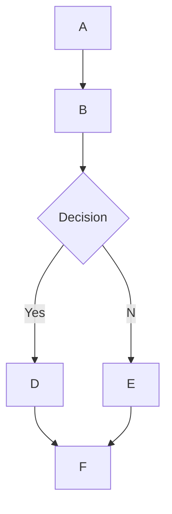

# 🌊 Sage WebUIにおけるMermaidJSレンダリングサポート

## 概要

Sage WebUIは、チャットインターフェース内で直接視覚的に魅力的なMermaidJSダイアグラム、フローチャート、円グラフなどをレンダリングする機能をサポートしています。MermaidJSは複雑な情報やアイデアを可視化する強力なツールであり、大規模言語モデル（LLM）の機能と組み合わせることで、新しいアイデアを生成・探求する強力なツールとなります。

## Sage WebUIでのMermaidJSの使用方法

MermaidJSダイアグラムを生成するには、任意のチャット内でLLMにMermaidJSを使用した図表作成を依頼します。例えば以下のようなリクエストが可能です：

* 「Mermaidを使用してシンプルな意思決定プロセスのフローチャートを作成してください。フローチャートの仕組みも説明してください」
* 「外に出て散歩するのが適切かどうかを判断する決定木をMermaidで可視化してください」

LLMの応答が正しくレンダリングされるためには、`mermaid`という単語で始まり、その後にMermaidJSコードが続く形式である必要があります。[MermaidJSドキュメント](https://mermaid.js.org/intro/)を参照して構文が正しいことを確認し、LLMがより良いMermaidJS構文を生成できるよう構造化されたプロンプトを提供できます。

## チャット内でのMermaidJSコードの直接可視化

MermaidJS可視化をリクエストすると、大規模言語モデル（LLM）が必要なコードを生成します。Sage WebUIは、コードが有効なMermaidJS構文を使用している限り、チャットインターフェース内で直接可視化を自動的にレンダリングします。

モデルがMermaidJS構文を生成しても可視化がレンダリングされない場合、通常はコード内に構文エラーがあることを示しています。心配ありません - 応答が完全に生成されるとエラーが通知されます。このような場合は、[MermaidJSドキュメント](https://mermaid.js.org/intro/)を参照して問題を特定し、プロンプトを修正してください。

## 可視化とのインタラクション

可視化が表示されたら、以下の操作が可能です：

* ズームイン/アウトして詳細を確認
* 表示領域の右上にあるコピーボタンをクリックして、可視化生成に使用された元のMermaidJSコードをコピー

### 例



これにより以下のようなフローチャートが生成されます：

```markdown
 startAncestor [ start ]
A[A] --> B[B]
B --> C[Decision]
C -->| Yes | D[D]
C -->| No  | E[E]
D --> F[F]
E --> F[F]
```

さまざまなタイプのダイアグラムやチャートを試すことで、Sage WebUI内でMermaidJSを効果的に活用する方法についてより深い理解を得ることができます。小規模なモデルの場合は、[MermaidJSドキュメント](https://mermaid.js.org/intro/)を参照してLLMのガイダンスとして提供したり、ドキュメントを包括的なノートやシステムプロンプトに要約させたりすることを検討してください。これらのガイドラインに従い、MermaidJSの機能を探求することで、Sage WebUIにおけるこの強力なツールの可能性を最大限に引き出すことができます。