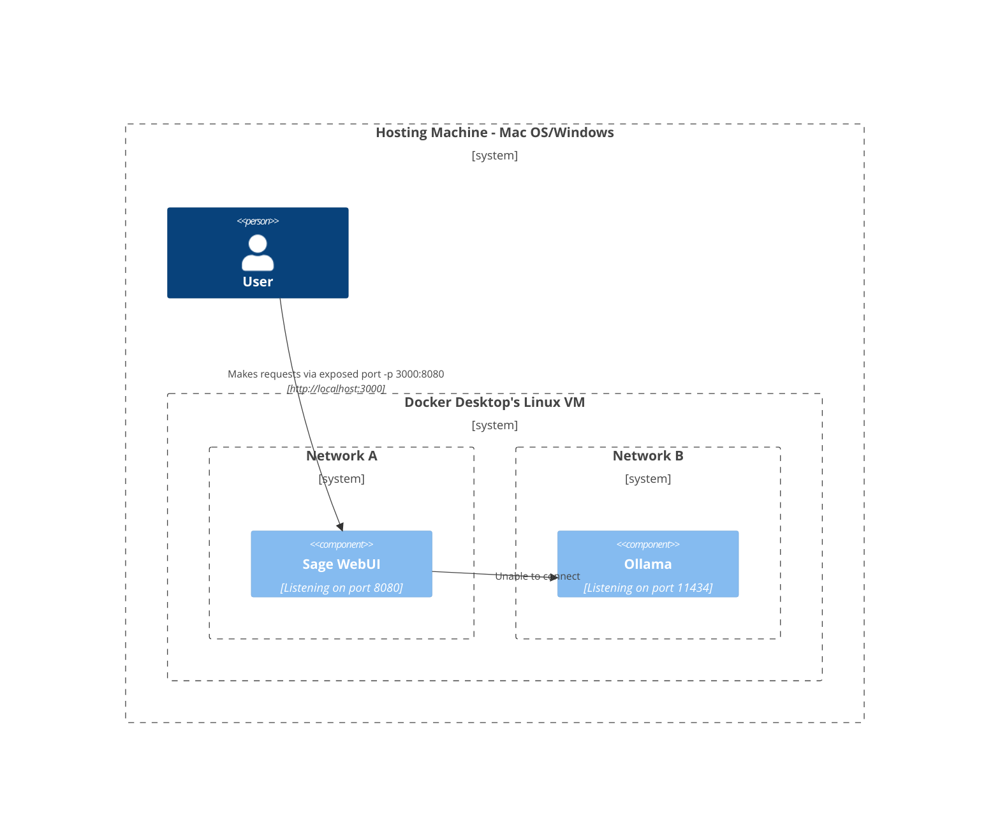
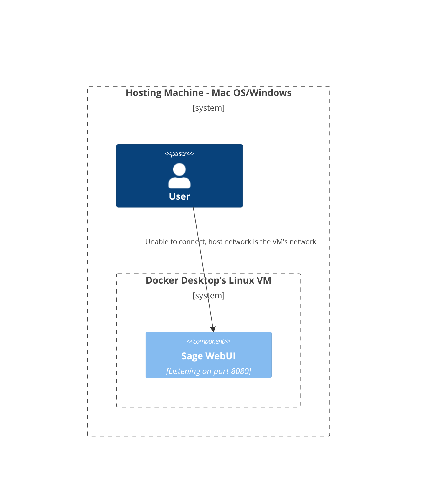
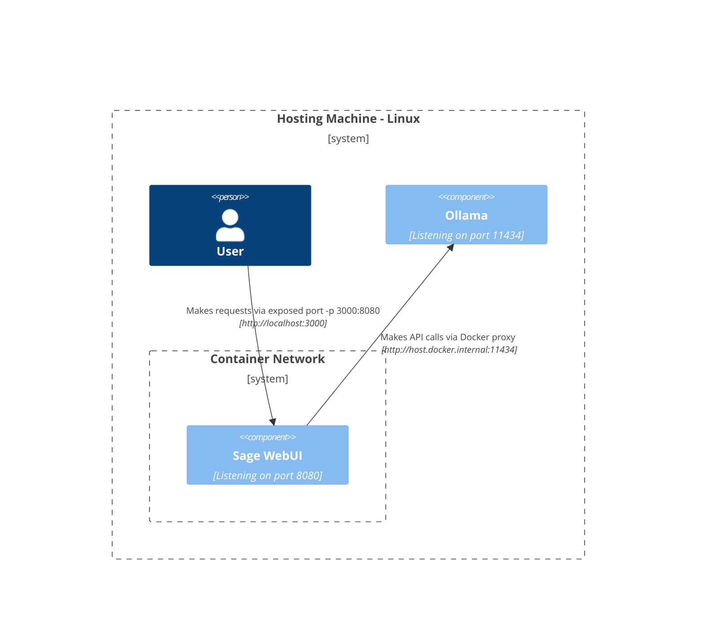
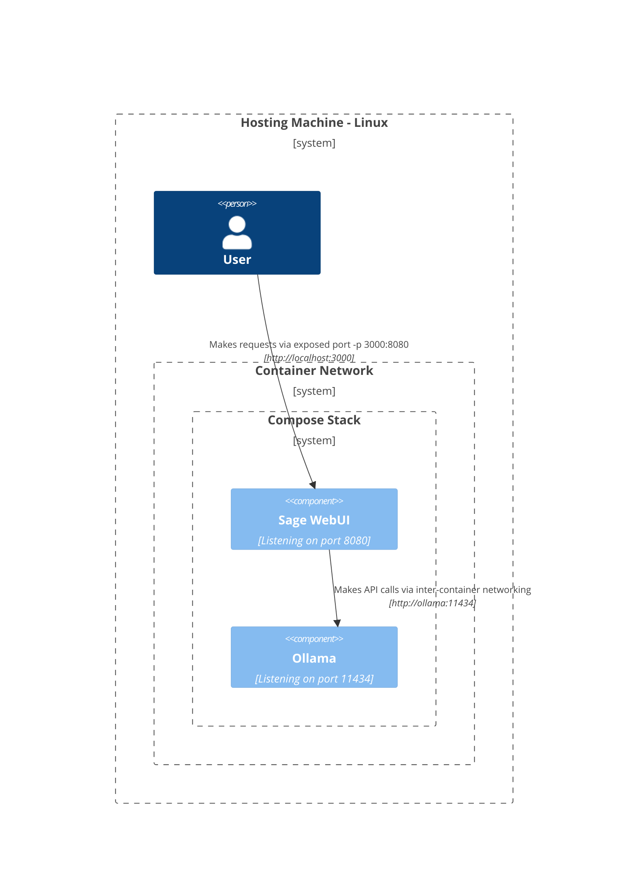
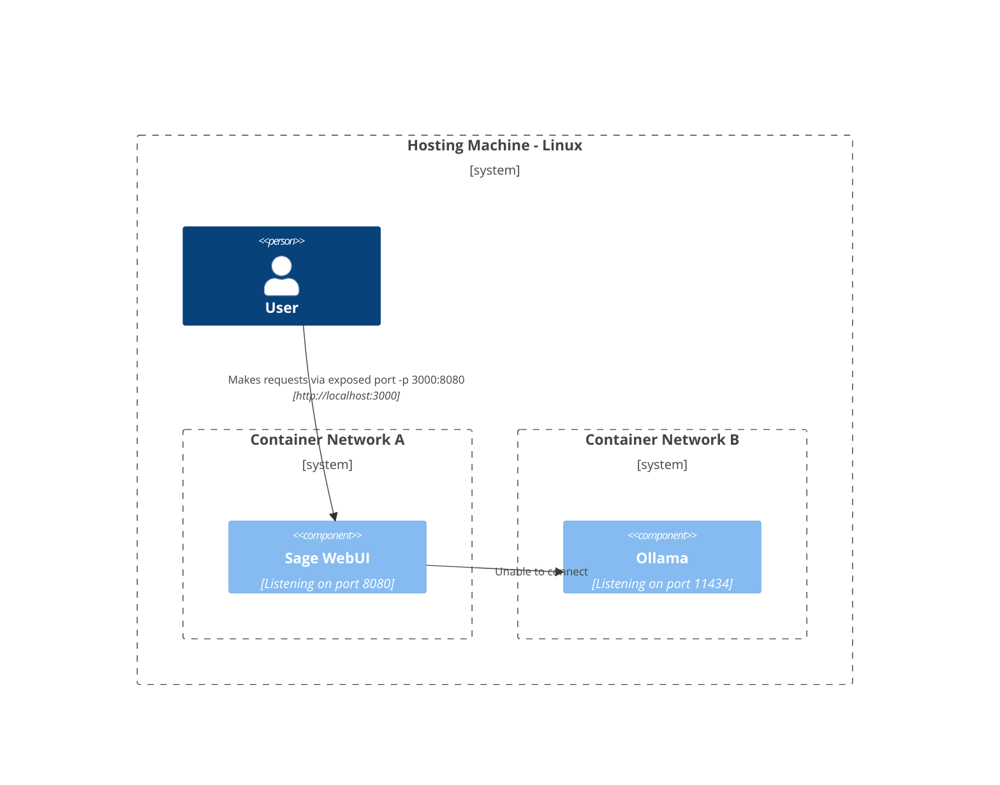
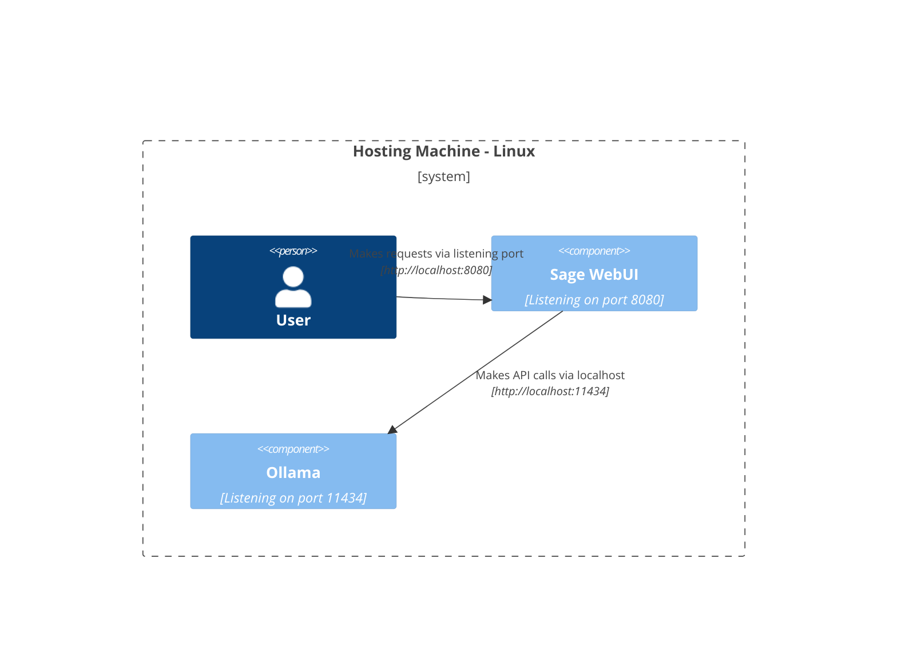

ここでは、ネットワークのさまざまなコンポーネントが異なるセットアップでどのように相互作用するかを理解するための明確で構造化されたダイアグラムを提供します。このドキュメントは、macOS/WindowsおよびLinuxユーザーの両方を支援するように設計されています。各シナリオは、システム構成と展開戦略に応じて設定された相互作用を示すためにMermaidダイアグラムを使用して説明されています。

## Mac OS/Windows セットアップオプション 🖥️

### ホスト上のOllama、コンテナ内のSage WebUI

このシナリオでは、`Ollama`がホストマシン上で直接実行され、`Sage WebUI`がDockerコンテナ内で動作します。

### Composeスタック内のOllamaとSage WebUI

`Ollama`と`Sage WebUI`の両方が同じDocker Composeスタック内で構成されており、ネットワーク通信が簡素化されています。

### 別々のネットワーク上のOllamaとSage WebUI

ここでは、`Ollama`と`Sage WebUI`が別々のDockerネットワークに展開されており、接続性の問題が発生する可能性があります。

### ホストネットワーク内のSage WebUI

この構成では、`Sage WebUI`がホストネットワークを利用しており、特定の環境での接続能力に影響を与えます。

## Linux セットアップオプション 🐧

### ホスト上のOllama、コンテナ内のSage WebUI（Linux）

このダイアグラムはLinuxプラットフォームに特化しており、`Ollama`がホスト上で実行され、`Sage WebUI`がDockerコンテナ内に展開されています。

### Composeスタック内のOllamaとSage WebUI（Linux）

`Ollama`と`Sage WebUI`の両方が同じDocker Composeスタック内に存在するセットアップで、Linux上でのシンプルなネットワークを可能にします。

### 別々のネットワーク上のOllamaとSage WebUI（Linux）

Linux環境下で`Ollama`と`Sage WebUI`が異なるDockerネットワークにあるシナリオで、接続性が妨げられる可能性があります。

### ホストネットワーク内のSage WebUI、ホスト上のOllama（Linux）

`Sage WebUI`と`Ollama`の両方がホストのネットワークを使用する最適なレイアウトで、Linuxシステム上でのシームレスな相互作用を促進します。

各セットアップは、異なる展開戦略とネットワーク構成に対応しており、要件に最適なレイアウトを選択するのに役立ちます。